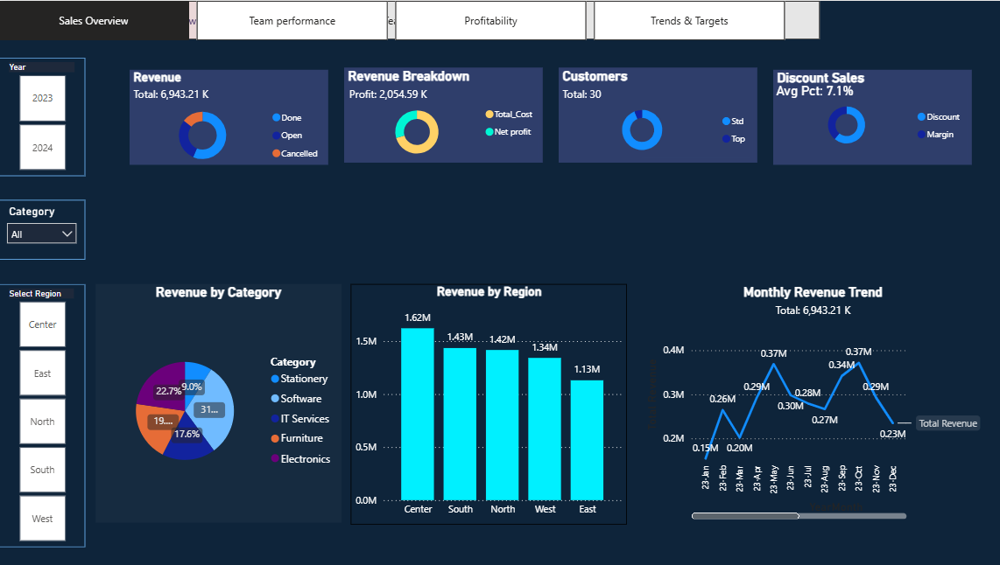
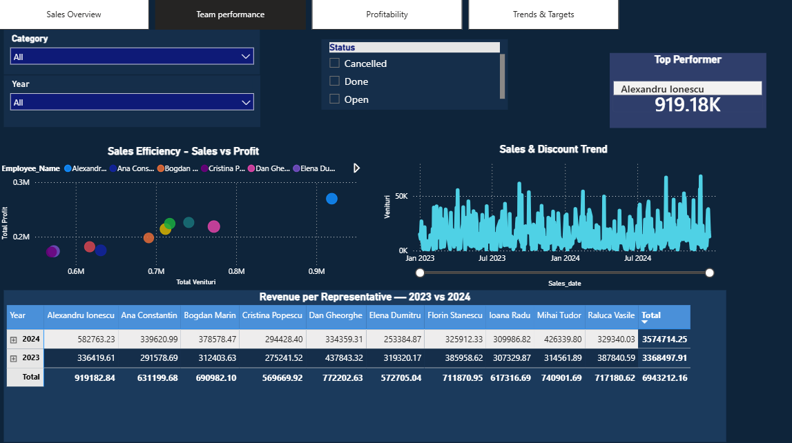
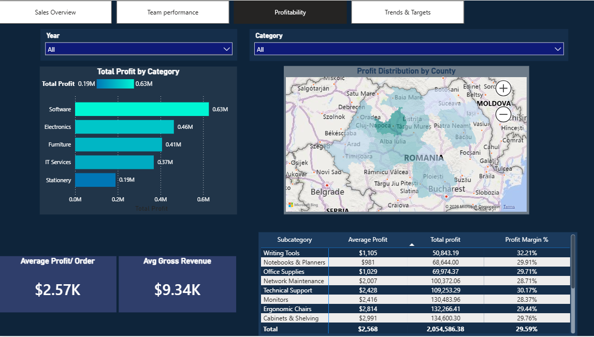
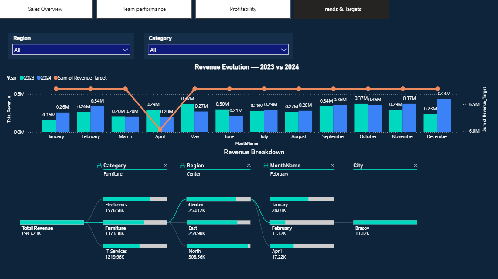
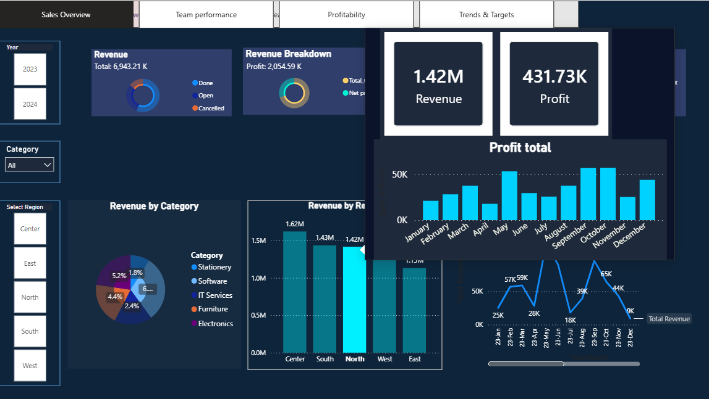

# 📊 Sales Dashboard - Power BI
This project features an interactive Power BI dashboard designed to analyze sales performance and business profitability.

## 🚀 Key Features
* **Sales Overview:** Comprehensive analysis of revenue growth and sales evolution over time.
* **Team Performance:** Evaluation and KPIs tracking for the sales team.
* **Profitability:** Detailed monitoring of profit margins and product profitability.
* **Trends & Targets:** Identification of market trends and tracking against set business goals.

## 📸 Visual Report Presentation (Screenshots)

### 1. Sales Overview

### 2. Team Performance

### 3. Profitability

### 4. Trends and Targets

### 5. Custom Interactive Tooltip

## 💡 Key Insights
* Software category generates the highest revenue share (31%), nearly triple the profit of Stationery.
* Center region outperforms all others, contributing ~20% more revenue than the lowest-performing region (East).
* Team performance grew ~6% year-over-year (2023 → 2024).

## 🛠️ Tech Stack & Skills
* **Power BI Desktop** - Data modeling, relationship building, and dashboard design.
* **DAX (Data Analysis Expressions)** - Developed custom measures, calculated columns, and time-intelligence KPIs.
* **Power Query** - Data extraction, cleaning, profiling, and transformation (ETL processes).
* **Custom Tooltips** - Designed report-page tooltips for enhanced data storytelling on hover.
